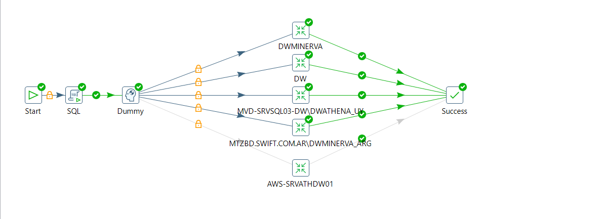

# Projeto Sanitização automática de objetos de ambientes analíticos

## Documentação interna
https://wiki.minervafoods.com/xwiki/bin/view/Tecnologia/Procedimento%20Operacional%20Padr%C3%A3o/Engenharia%20de%20Dados/.Constru%C3%A7%C3%A3o/Procedimento%20de%20Sanitiza%C3%A7%C3%A3o/

## Job orquestratora



`/home/.Oficial/Data Governance/Sanitization Tables`

Essa job realiza a atualização da tabela de controle, usada no processo de sanitização automática

```sql
select * from dw_refined.data_engineer.tab_analytical_tables_sanitization
```

Para instalar as dependências do projeto, execute o comando
```bash
pip install -r requirements.txt
```